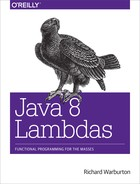

# Java-8-Lambdas-zh

《Java 8 函数式编程》中文翻译

在线阅读：[http://gdut_yy.gitee.io/doc-java8/](http://gdut_yy.gitee.io/doc-java8/)



## 目录

- [前言](docs/preface.md)
- [第 1 章 简介](docs/ch1.md)
- [第 2 章 Lambda 表达式](docs/ch2.md)
- [第 3 章 流](docs/ch3.md)
- [第 4 章 类库](docs/ch4.md)
- [第 5 章 高级集合类和收集器](docs/ch5.md)
- [第 6 章 数据并行化](docs/ch6.md)
- [第 7 章 测试、调试和重构](docs/ch7.md)
- [第 8 章 设计和架构的原则](docs/ch8.md)
- [第 9 章 使用 Lambda 表达式编写并发程序](docs/ch9.md)
- [第 10 章 下一步该怎么办](docs/ch10.md)

## 本地开发 & 阅读

本项目基于 vuepress 进行开发，以提供比 github mardown 更佳的阅读体验

依赖于 `node.js`、`yarn`、`vuepress` 等环境

```sh
# vuepress
yarn global add vuepress

# 本地开发
git clone https://github.com/gdut-yy/Java-8-Lambdas-zh.git
cd Java-8-Lambdas-zh/
yarn docs:dev
```

## License

[MIT](./LICENSE)
